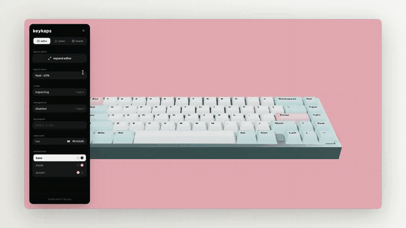
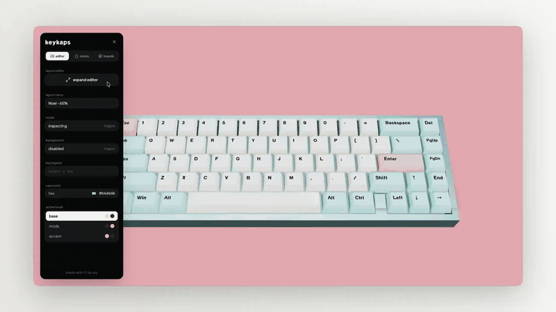
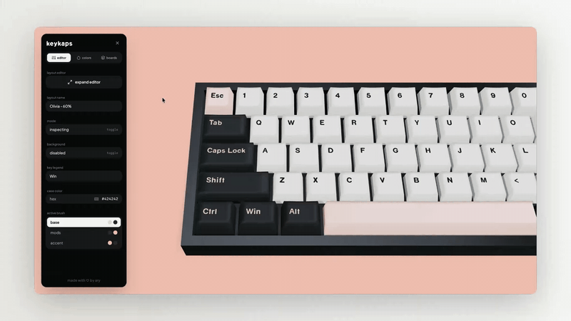

# Turn Your Keyboard Layouts Into Interactive 3D Models

I've always wanted a tool where you can see and experience a keyboard layout before building it. So, I decided to build it myself! Introducing, **Keykaps**!

## Create or Import a Keyboard Layout

Import a KLE json, or a .keykap file to start.
You can view your layout in the editor.

## Edit a Keyboard Layout

Expand the layout editor to add more keys, change positions, legends, colors, sizes, etc.
The layout editor is a more powerful and intuitive version of the normal [Keyboard Layout Editor.](https://www.keyboard-layout-editor.com/)

## Colorways and Brushes

You can create colorways for your favorite keycaps and paint on the keyboard with them, by toggling to the paint mode, selecting the swatch and clicking over the keys.

## Sounds

https://github.com/user-attachments/assets/4f19c780-f8ce-474a-856b-8781e0518bd4

Press and interact with the keys with your keyboard to see the 3D model react to it. The sound files are very thocky!

And much, much more.

## AI Usage
AI was used for debugging.

GIF visuals were recorded and created using my project [Glare!](https://github.com/aryan-madan/Glare)

Made with ❤️ by Ary
